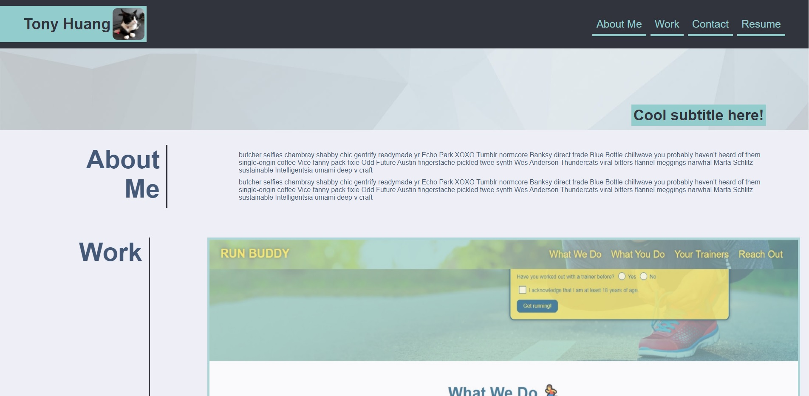
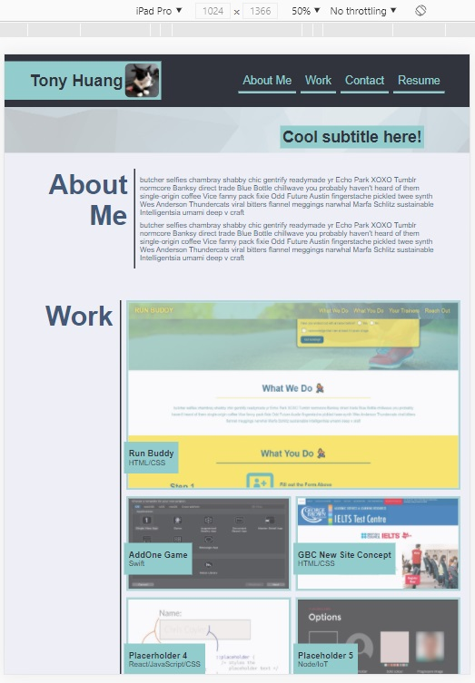
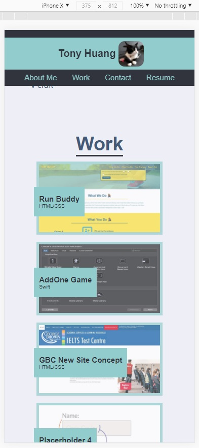

## Professional Portfolio

## Purpose
The purpose of this project was to create a page to showcase the projects I have/will work on through the bootcamp.

## Built With
* HTML
* CSS
## Website 
https://zoomzooom6.github.io/Portfolio_Bootcamp/

## Contribution
Designed by Tony Huang

The website is to be responsive depending on how the user accesses the website. Items throughout the page should resize/scale depending on the device. 

# View on desktop

# View on tablet

# View on mobile
